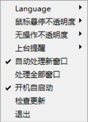

# ClassIn Mover 使用说明

1. [下载一个最新版本的ClassIn Mover](https://classin-mover.pages.dev/)，将zip解压，找到里面的`ClassIn_Mover_【版本号】.exe`。注意由于系统设置的不同，可能不显示`.exe`。 

2. 运行此程序。杀毒软件可能会提出警告等，如果发生了这些情况，请允许。

3. 程序启动时，由于系统设置不同，可能会弹出用户账户控制（UAC），请尽量点击“是”。在没有管理员权限的账户下，可能会要求输入密码，如果不知道管理员密码的情况下在选择“否”。这不会影响程序的正常运行，只是有可能让操控窗口失效。 程序启动后，如果没有管理员权限，仍然可以右键点击悬浮球开启。 

4. 程序启动后会只显示半透明的悬浮球。启动时，悬浮球在靠近屏幕左上角。左键点击可以打开主窗口，右键可以调出系统菜单。 
 

5. 2.2.0及更新版本支持上台提醒，提醒基于摄像头和麦克风调用检测，部分系统由于系统设置无法启用此功能。请注意，目前不支持多个教室窗口的检测。 
 

6. 2.2.0 开启开机自启动默认处于关闭状态，可自行开启。去除教室水印功能从主界面打开 

7. **去水印功能目前仍处于测试阶段，如有问题请加群反馈** 可能会导致classin崩溃或系统不稳定，有问题一定要反馈！ 注意去水印时请务必完整输入要去除的水印内容，否则可能导致 ClassIn 崩溃或找不到水印。请注意检查有没有空格。 
 

8. 启动程序后默认开启“自动处理新窗口”，当检测到有新的ClassIn教室窗口打开时会进行“自动处理”。根据学校后台设置不同，进入教室时（指打开了教室窗口且倒计时结束后）可能会再次强制置顶，所以处理新窗口会延时8.5秒，以确保已经成功进入教室。

9. 如果已经进入教室后老师开启了专注学习模式，可以点击“处理全部窗口”。处理全部窗口不会延迟。

10. 主窗口上可以对窗口进行更多操作，如移动、调整大小等。关闭主窗口不会让程序退出，想要退出可以通过主窗口右下角的“退出”按钮或右键菜单上的“退出”。 

11. 现在如果进入了多个教室，可以在窗口之间进行选择。（不过正常情况谁会进多个教室呢？） 

> 注：
>
> 1. ClassIn在2021年的一次更新（版本号未知）解决了Win7下用任务管理器最小化的Bug。ClassIn Mover目前还没有找到最小化开启了专注学习模式的ClassIn窗口的方法。不过，你可以把它拖走（比如屏幕外面）或者调小（比如1×1）。
>
> 2. 自动处理的过程：
> - 将窗口最小化
> - 将窗口最大化
> - 强制窗口移动到客户区域（即屏幕不被任务栏占据的范围）

